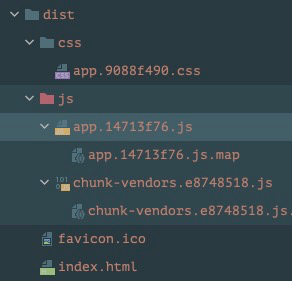
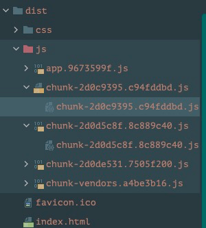

### v-router路由的懒加载

#### 认识路由的懒加载
官方解释:
* 当打包构建应用时，JavaScript包会变得非常大，影响页面加载
* 如果我们能把不同路由对应的组件分割成不同代码块，然后当路由被访问的时候才加载对应组件，这样就更加高效


1. app.js是开发者写的代码都在里面(业务代码)
2. vendor (vue/vue-router/axios) 第三方库的代码

#### 路由懒加载方式
```vue
{
    path: '/home',
    component: () => import('../components/Home')
  },
  {
    path: '/about',
    component: () => import('../components/About')
  },
  {
    path: '/user/:id',
    component: () => import('../components/User')
  }
```


* 懒加载写法之后路由
* 新增这几个js文件
